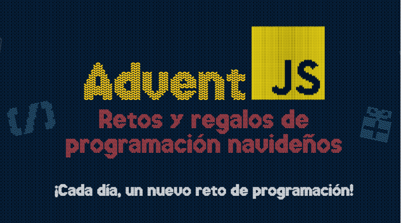

# AdventJS 2022

- [AdventJS](https://adventjs.dev/ "AdventJS")
- Soluciones con Javascript

# Retos

| Nº  | Título                             | Dificultad | Solución                                                                        |
| --- | ---------------------------------- | ---------- | ------------------------------------------------------------------------------- |
| 01  | 🎁 ¡Primer regalo repetido!        | Fácil      | [Enlace](https://github.com/facindito/AdventJS/blob/main/2023/reto-01/index.js) |
| 02  | 🏭 Ponemos en marcha la fábrica    | Fácil      | [Enlace](https://github.com/facindito/AdventJS/blob/main/2023/reto-02/index.js) |
| 03  | 😏 El elfo travieso                | Fácil      | [Enlace](https://github.com/facindito/AdventJS/blob/main/2023/reto-03/index.js) |
| 04  | 😵‍💫 Dale la vuelta a los paréntesis | Medio      | [Enlace](https://github.com/facindito/AdventJS/blob/main/2023/reto-04/index.js) |
| 05  | 🛷 El CyberTruck de Santa          | Medio      | [Enlace](https://github.com/facindito/AdventJS/blob/main/2023/reto-05/index.js) |
| 06  | 🦌 Los renos a prueba              | Fácil      | [Enlace](https://github.com/facindito/AdventJS/blob/main/2023/reto-06/index.js) |
| 07  | 📦 Las cajas en 3D                 | Fácil      | [Enlace](https://github.com/facindito/AdventJS/blob/main/2023/reto-07/index.js) |
